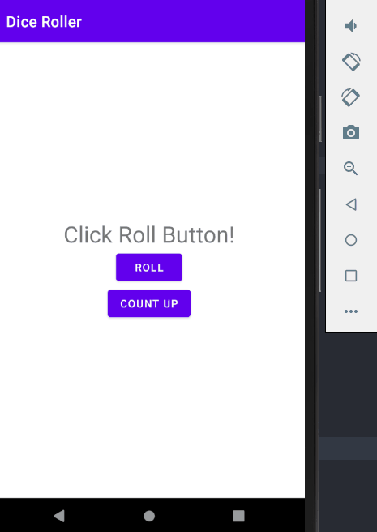

## DiceRoller - Android

# 목표

-  강의 : https://developer.android.com/codelabs/kotlin-android-training-app-anatomy#0

-  Button 클릭 시 1..6 숫자 데이터가 랜덤으로 표시

# 결과

[Virtual Device] - Nexus 5X (API LEVEL 30)


# 코딩 챌린지

-  Roll Button 옆에 Count Up 이라는 Button 추가. Tap 하면 현재 값을 가져와서 1을 추가하여 TextView 업데이트
-  TextView 가 String 이라면 결과 값은 1
-  TextView 가 6이라면 아무것도 하지 않음

[Virtual Device] - Nexus 5X (API LEVEL 30)



# ETC

## **Extract string resources**

-  레이아웃이나 코드 파일에 문자열을 하드코딩하는 대신 모든 앱 문자열을 별도의 파일에 넣어 관리한다.
-  관리는 res/values/ 안에 strings.xml 파일 안에서 할 수 있다.
-  특히, 해당 문자열이 2번 이상 사용될 경우 더욱 쉽게 관리할 수 있다.

## **res/layout**

res/layout에 activity_main 으로 가보면 3가지의 탭으로 앱을 볼 수 있다.

1. Design : 앱의 레이아웃을 실제 휴대폰에서 보는 것과 같이 보여준다.
2. Code : 앱의 레이아웃을 xml 로 보여준다.
3. Split : Design, Code 를 반 반 보여준다.

## **xml**

e**X**tensible **M**arkup **L**anguage 의 약어. W3C 에서 여러 특수 목적의 마크업 언어를 만드는 용도에서 권장되는 다목적 마크업 언어이다. 마크업 언어는 태그 등을 이용하여 데이터의 구조를 기술하는 언어의 한 가지이다.

예를 들어, HTML에서는

```
CPU 2.83GHz
```

라는 데이터를 표기할 때 어디부터가 데이터 명이고 어디부터가 실제 데이터인지 표시할 수 있는 마땅한 방법이 없다.

이런 문제를 해결하기 위해 XML을 이용하면 어디부터 어디까지가 데이터 이름이고 어디부터 어디까지가 실제 데이터이며 어디부터 어디까지가 데이터 단위인지도 표현이 가능하다.

즉,데이터에 의미를 부여하는 메타데이터를 기술할 수 있다. XML은 바로 이러한 목적으로 탄생했다. 위의 예를 XML로 바꾸면 데이터 명은

```
<dataname>CPU</dataname>
```

가 되고 데이터 값은

```
<datavalue>2.83</datavalue>
```

이 된다.

이런 XML의 특징은 수많은 종류의 데이터를 유연하고 자유롭게 기술하는 데 적용할 수 있어서 다양한 용도로 응용할 수 있으며, 인터넷으로 연결된 시스템끼리 쉽게 식별 가능한 데이터를 주고받을 수 있게 된다.

`참고사이트`

1. [https://namu.wiki/w/XML](https://namu.wiki/w/XML) : 위 내용
2. [https://support.microsoft.com/ko-kr/office/초보자를-위한-xml-설명-a87d234d-4c2e-4409-9cbc-45e4eb857d44](https://support.microsoft.com/ko-kr/office/%EC%B4%88%EB%B3%B4%EC%9E%90%EB%A5%BC-%EC%9C%84%ED%95%9C-xml-%EC%84%A4%EB%AA%85-a87d234d-4c2e-4409-9cbc-45e4eb857d44) : ms에 나와있는 xml 설명
